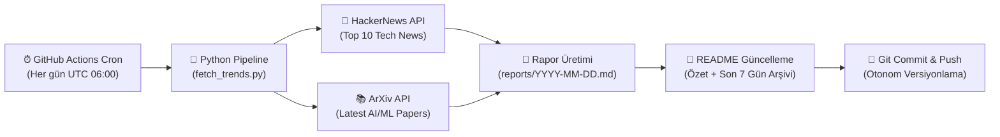

# 📡 AI & Tech Daily Radar

<p align="center">
  
  
  
  
  
</p>

> **AI & Tech Daily Radar**, her gün GitHub Actions üzerinde otonom olarak çalışan; HackerNews üzerindeki en sıcak teknoloji gelişmelerini ve ArXiv üzerindeki en yeni Yapay Zeka / Makine Öğrenimi (AI & ML) araştırma makalelerini toplayıp derleyen modern bir veri hattıdır (data pipeline).

---

<!-- LATEST_REPORT_START -->
### ⚡ Son Güncelleme: `2026-10-07`

> 📊 **Bugünün Özeti:** 10 HackerNews teknoloji trendi ve 5 ArXiv AI/ML akademik makalesi tarandı.  
> 📑 **Tam Rapor:** [Günün Raporunu Görüntüle (`reports/2026-10-07.md`)](reports/2026-10-07.md)

#### 🔥 HackerNews Öne Çıkanlar
| Başlık | Puan | Yorum | HN Linki |
|--------|:----:|:-----:|:--------:|
| [Mistral Large 4](https://mistral.ai/news/mistral-large-4/\) | ⭐ 1884 | 💬 1134 | [Tartışma](https://news.ycombinator.com/item?id=49977979) |
| [Sharing AI progress in mathematics](https://openai.com/index/sharing-ai-progress-in-mathematics/) | ⭐ 1009 | 💬 986 | [Tartışma](https://news.ycombinator.com/item?id=49984923) |
| [EmbeddingGemma 2: An open, lightweight multimodal embedding model](https://blog.google/innovation-and-ai/technology/developers-tools/embeddinggemma-2/) | ⭐ 357 | 💬 35 | [Tartışma](https://news.ycombinator.com/item?id=49980487) |
| [Decisions API is in public beta](https://developers.openai.com/api/docs/guides/decisions) | ⭐ 336 | 💬 178 | [Tartışma](https://news.ycombinator.com/item?id=49984025) |
| [Tell HN: GitHub refuses to remove cracked copies of my software after a month](https://news.ycombinator.com/item?id=49982498) | ⭐ 334 | 💬 179 | [Tartışma](https://news.ycombinator.com/item?id=49982498) |

#### 🤖 ArXiv AI/ML Öne Çıkan Araştırmalar
- 📄 **[QF3: Fast Flow RL with Filtered Q-Gradients](http://arxiv.org/abs/2610.08789v1)**
  *Flow policies have become a standard policy class for learning robot behaviors from demonstrations, but reinforcement learning is still critical for improving pre-trained flow policies or learning the...*

- 📄 **[Conformal Prediction Sets Quantify Information Gain: A Theoretical Perspective](http://arxiv.org/abs/2610.08785v1)**
  *Conformal prediction is a popular tool for uncertainty quantification that outputs prediction sets with finite-sample coverage guarantees. While prediction set size is commonly used as a heuristic mea...*

- 📄 **[4D-HOF: Hand-Object Flow Matching for Feed-Forward 4D Interaction Reconstruction](http://arxiv.org/abs/2610.08782v1)**
  *Existing methods for 4D hand-object reconstruction often rely on costly per-sequence optimization, while generative approaches typically synthesize interactions from random noise, which can lead to un...*

#### 🗄️ Son 7 Günün Rapor Arşivi
- [📅 2026-10-07 Raporu](reports/2026-10-07.md)
- [📅 2026-10-06 Raporu](reports/2026-10-06.md)
- [📅 2026-10-05 Raporu](reports/2026-10-05.md)
- [📅 2026-10-04 Raporu](reports/2026-10-04.md)
- [📅 2026-10-03 Raporu](reports/2026-10-03.md)
<!-- LATEST_REPORT_END -->

---

## 🏗️ Mimari ve Nasıl Çalışır?

Bu sistem, harici bir sunucu veya veritabanı ihtiyacı olmadan tamamen **serverless** ve **Git-as-a-Database** yaklaşımıyla çalışacak şekilde tasarlanmıştır:



### ⚙️ Çalışma Aşamaları (ETL)

1. **Extract (Çıkarma):**
   - **HackerNews Algolia API:** Günün en popüler 10 teknoloji trendini (başlık, puan, yorum sayısı, URL) çeker.
   - **ArXiv API:** Bilgisayar Bilimleri / Yapay Zeka (`cs.AI`) ve Makine Öğrenimi (`cs.LG`) kategorilerinde yayımlanan en güncel 5 akademik makaleyi (`ElementTree` XML ayrıştırıcı ile) çeker.

2. **Transform (Dönüştürme):**
   - Alınan ham veriler standart bir Markdown formatına dönüştürülür.
   - Makale özetleri optimize edilir, tablolar ve bağlantılar biçimlendirilir.
   - Son 7 günün arşiv linkleri otomatik tespit edilir.

3. **Load (Yükleme & Dağıtım):**
   - Günün tarihine özel `reports/YYYY-MM-DD.md` dosyası oluşturulur.
   - Ana dizindeki `README.md` dosyasındaki belirlenmiş işaretçiler arasına güncel özet ve arşiv tablosu işlenir.
   - Değişiklikler GitHub Actions botu tarafından depoya geri `commit` ve `push` edilir.

---

## 🚀 Yerel Kurulum ve Çalıştırma

Projeyi yerel makinenizde test etmek isterseniz:

```bash
# 1. Projeyi klonlayın
git clone https://github.com/themuhammedguler/ai-tech-radar.git
cd ai-tech-radar

# 2. Bağımlılıkları yükleyin
pip install -r requirements.txt

# 3. Veri hattını çalıştırın
python src/fetch_trends.py
```

Rapor oluşturulduktan sonra `reports/` dizinini ve `README.md` dosyasını inceleyebilirsiniz.

---

## 📜 Lisans

Bu proje [MIT](LICENSE) lisansı ile lisanslanmıştır.
