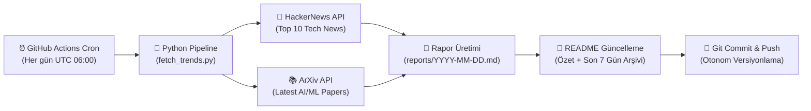

# 📡 AI & Tech Daily Radar

<p align="center">
  
  
  
  
  
</p>

> **AI & Tech Daily Radar**, her gün GitHub Actions üzerinde otonom olarak çalışan; HackerNews üzerindeki en sıcak teknoloji gelişmelerini ve ArXiv üzerindeki en yeni Yapay Zeka / Makine Öğrenimi (AI & ML) araştırma makalelerini toplayıp derleyen modern bir veri hattıdır (data pipeline).

---

<!-- LATEST_REPORT_START -->
### ⚡ Son Güncelleme: `2026-10-09`

> 📊 **Bugünün Özeti:** 10 HackerNews teknoloji trendi ve 5 ArXiv AI/ML akademik makalesi tarandı.  
> 📑 **Tam Rapor:** [Günün Raporunu Görüntüle (`reports/2026-10-09.md`)](reports/2026-10-09.md)

#### 🔥 HackerNews Öne Çıkanlar
| Başlık | Puan | Yorum | HN Linki |
|--------|:----:|:-----:|:--------:|
| [Why isn't the industry freaking out about DeepSeek 4.1 Flash?](https://www.dgt.is/blog/2026-10-07-deepseek-freek-out/) | ⭐ 839 | 💬 751 | [Tartışma](https://news.ycombinator.com/item?id=50000488) |
| [Whistle: Speech to Text in 16.9 MB](https://cactuscompute.com/blog/whistle) | ⭐ 807 | 💬 162 | [Tartışma](https://news.ycombinator.com/item?id=50008427) |
| [Man discovers his parents' coffee machine used 1TB of data in 10 days](https://www.dexerto.com/entertainment/man-discovers-his-parents-coffee-machine-used-1tb-of-data-in-10-days-3416399/) | ⭐ 757 | 💬 469 | [Tartışma](https://news.ycombinator.com/item?id=49995495) |
| [I hired an illustrator to draw my house. Now it's my Home Assistant dashboard](https://antonfrolov.substack.com/p/i-hired-an-illustrator-to-draw-my) | ⭐ 709 | 💬 137 | [Tartışma](https://news.ycombinator.com/item?id=49986882) |
| [Yes, and](https://htmx.org/essays/yes-and/) | ⭐ 512 | 💬 176 | [Tartışma](https://news.ycombinator.com/item?id=50003796) |

#### 🤖 ArXiv AI/ML Öne Çıkan Araştırmalar
- 📄 **[CSF: Contextual Safety Filtering for Motion Generators](http://arxiv.org/abs/2610.12467v1)**
  *Text-conditioned motion generators produce trackable whole-body motion, but they have no notion of scene-dependent safety: the same action may target an object or a person. Existing safeguards either...*

- 📄 **[On the estimation and validity of AI time horizons---a statistical look at the METR plot](http://arxiv.org/abs/2610.12466v1)**
  *METR's 50\% time horizon measures the human completion time of software tasks that an AI solves with 50\% probability, allowing AI capabilities to be expressed in interpretable units. On 228 tasks and...*

- 📄 **[A Balanced Data Diet: Addressing the Exploration Bottleneck in Mega-Scale RL for Robot Control](http://arxiv.org/abs/2610.12465v1)**
  *General-purpose robots must perform a wide range of tasks from agile locomotion to dexterous manipulation. While sim-to-real reinforcement learning (RL) has proven to be a useful tool for this goal, c...*

#### 🗄️ Son 7 Günün Rapor Arşivi
- [📅 2026-10-09 Raporu](reports/2026-10-09.md)
- [📅 2026-10-08 Raporu](reports/2026-10-08.md)
- [📅 2026-10-07 Raporu](reports/2026-10-07.md)
- [📅 2026-10-06 Raporu](reports/2026-10-06.md)
- [📅 2026-10-05 Raporu](reports/2026-10-05.md)
- [📅 2026-10-04 Raporu](reports/2026-10-04.md)
- [📅 2026-10-03 Raporu](reports/2026-10-03.md)
<!-- LATEST_REPORT_END -->

---

## 🏗️ Mimari ve Nasıl Çalışır?

Bu sistem, harici bir sunucu veya veritabanı ihtiyacı olmadan tamamen **serverless** ve **Git-as-a-Database** yaklaşımıyla çalışacak şekilde tasarlanmıştır:



### ⚙️ Çalışma Aşamaları (ETL)

1. **Extract (Çıkarma):**
   - **HackerNews Algolia API:** Günün en popüler 10 teknoloji trendini (başlık, puan, yorum sayısı, URL) çeker.
   - **ArXiv API:** Bilgisayar Bilimleri / Yapay Zeka (`cs.AI`) ve Makine Öğrenimi (`cs.LG`) kategorilerinde yayımlanan en güncel 5 akademik makaleyi (`ElementTree` XML ayrıştırıcı ile) çeker.

2. **Transform (Dönüştürme):**
   - Alınan ham veriler standart bir Markdown formatına dönüştürülür.
   - Makale özetleri optimize edilir, tablolar ve bağlantılar biçimlendirilir.
   - Son 7 günün arşiv linkleri otomatik tespit edilir.

3. **Load (Yükleme & Dağıtım):**
   - Günün tarihine özel `reports/YYYY-MM-DD.md` dosyası oluşturulur.
   - Ana dizindeki `README.md` dosyasındaki belirlenmiş işaretçiler arasına güncel özet ve arşiv tablosu işlenir.
   - Değişiklikler GitHub Actions botu tarafından depoya geri `commit` ve `push` edilir.

---

## 🚀 Yerel Kurulum ve Çalıştırma

Projeyi yerel makinenizde test etmek isterseniz:

```bash
# 1. Projeyi klonlayın
git clone https://github.com/themuhammedguler/ai-tech-radar.git
cd ai-tech-radar

# 2. Bağımlılıkları yükleyin
pip install -r requirements.txt

# 3. Veri hattını çalıştırın
python src/fetch_trends.py
```

Rapor oluşturulduktan sonra `reports/` dizinini ve `README.md` dosyasını inceleyebilirsiniz.

---

## 📜 Lisans

Bu proje [MIT](LICENSE) lisansı ile lisanslanmıştır.
