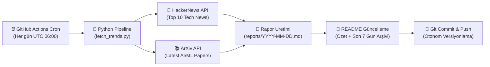

# 📡 AI & Tech Daily Radar

<p align="center">
  
  
  
  
  
</p>

> **AI & Tech Daily Radar**, her gün GitHub Actions üzerinde otonom olarak çalışan; HackerNews üzerindeki en sıcak teknoloji gelişmelerini ve ArXiv üzerindeki en yeni Yapay Zeka / Makine Öğrenimi (AI & ML) araştırma makalelerini toplayıp derleyen modern bir veri hattıdır (data pipeline).

---

<!-- LATEST_REPORT_START -->
### ⚡ Son Güncelleme: `2026-10-03`

> 📊 **Bugünün Özeti:** 10 HackerNews teknoloji trendi ve 5 ArXiv AI/ML akademik makalesi tarandı.  
> 📑 **Tam Rapor:** [Günün Raporunu Görüntüle (`reports/2026-10-03.md`)](reports/2026-10-03.md)

#### 🔥 HackerNews Öne Çıkanlar
| Başlık | Puan | Yorum | HN Linki |
|--------|:----:|:-----:|:--------:|
| [Court agrees with EFF: Utah's VPN law demands a technical impossibility](https://www.eff.org/deeplinks/2026/10/court-agrees-eff-utahs-vpn-law-demands-technical-impossibility) | ⭐ 766 | 💬 371 | [Tartışma](https://news.ycombinator.com/item?id=49927754) |
| [Mike Tomlin spent 12 years building a Minecraft city](https://www.nytimes.com/athletic/7648198/2026/10/01/mike-tomlin-minecraft-nfl-coach/) | ⭐ 631 | 💬 152 | [Tartışma](https://news.ycombinator.com/item?id=49925184) |
| [Apple Pass Designer](https://developer.apple.com/pass-designer/) | ⭐ 536 | 💬 320 | [Tartışma](https://news.ycombinator.com/item?id=49937276) |
| [FLUX 3 Image](https://bfl.ai/models/flux-3-image) | ⭐ 420 | 💬 92 | [Tartışma](https://news.ycombinator.com/item?id=49925974) |
| [Newgrounds.com – A community of games, music, and art](https://www.newgrounds.com/) | ⭐ 411 | 💬 121 | [Tartışma](https://news.ycombinator.com/item?id=49940394) |

#### 🤖 ArXiv AI/ML Öne Çıkan Araştırmalar
- 📄 **[One Basis to Animate Them All: Gaussian Blendshape Distillation for Real-Time Avatars](http://arxiv.org/abs/2610.02207v1)**
  *3D Gaussian avatars support fast rendering, however, their real-time animation is often challenged by the costly neural inference. We address this bottleneck and show that the animation of pretrained...*

- 📄 **[KaliBench: A Fine-Grained Benchmark for Cybersecurity Tool Use on Kali Linux with Runtime-Free Verifiable Rewards](http://arxiv.org/abs/2610.02206v1)**
  *LLMs are increasingly applied to cybersecurity workflows, where they are expected to translate analysts' intent into tool invocations. However, existing evaluations focus on knowledge-based assessment...*

- 📄 **[Reconstruct, Practice, Go Real: Guided Self-Improvement for Embodied Agents](http://arxiv.org/abs/2610.02204v1)**
  *Building reliable robot capabilities across diverse tasks requires substantial human effort to develop and maintain skills, design rewards, and integrate perception with control. We present Reconstruc...*

#### 🗄️ Son 7 Günün Rapor Arşivi
- [📅 2026-10-03 Raporu](reports/2026-10-03.md)
<!-- LATEST_REPORT_END -->

---

## 🏗️ Mimari ve Nasıl Çalışır?

Bu sistem, harici bir sunucu veya veritabanı ihtiyacı olmadan tamamen **serverless** ve **Git-as-a-Database** yaklaşımıyla çalışacak şekilde tasarlanmıştır:



### ⚙️ Çalışma Aşamaları (ETL)

1. **Extract (Çıkarma):**
   - **HackerNews Algolia API:** Günün en popüler 10 teknoloji trendini (başlık, puan, yorum sayısı, URL) çeker.
   - **ArXiv API:** Bilgisayar Bilimleri / Yapay Zeka (`cs.AI`) ve Makine Öğrenimi (`cs.LG`) kategorilerinde yayımlanan en güncel 5 akademik makaleyi (`ElementTree` XML ayrıştırıcı ile) çeker.

2. **Transform (Dönüştürme):**
   - Alınan ham veriler standart bir Markdown formatına dönüştürülür.
   - Makale özetleri optimize edilir, tablolar ve bağlantılar biçimlendirilir.
   - Son 7 günün arşiv linkleri otomatik tespit edilir.

3. **Load (Yükleme & Dağıtım):**
   - Günün tarihine özel `reports/YYYY-MM-DD.md` dosyası oluşturulur.
   - Ana dizindeki `README.md` dosyasındaki belirlenmiş işaretçiler arasına güncel özet ve arşiv tablosu işlenir.
   - Değişiklikler GitHub Actions botu tarafından depoya geri `commit` ve `push` edilir.

---

## 🚀 Yerel Kurulum ve Çalıştırma

Projeyi yerel makinenizde test etmek isterseniz:

```bash
# 1. Projeyi klonlayın
git clone https://github.com/themuhammedguler/ai-tech-radar.git
cd ai-tech-radar

# 2. Bağımlılıkları yükleyin
pip install -r requirements.txt

# 3. Veri hattını çalıştırın
python src/fetch_trends.py
```

Rapor oluşturulduktan sonra `reports/` dizinini ve `README.md` dosyasını inceleyebilirsiniz.

---

## 📜 Lisans

Bu proje [MIT](LICENSE) lisansı ile lisanslanmıştır.
