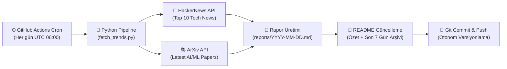

# 📡 AI & Tech Daily Radar

<p align="center">
  
  
  
  
  
</p>

> **AI & Tech Daily Radar**, her gün GitHub Actions üzerinde otonom olarak çalışan; HackerNews üzerindeki en sıcak teknoloji gelişmelerini ve ArXiv üzerindeki en yeni Yapay Zeka / Makine Öğrenimi (AI & ML) araştırma makalelerini toplayıp derleyen modern bir veri hattıdır (data pipeline).

---

<!-- LATEST_REPORT_START -->
### ⚡ Son Güncelleme: `2026-10-06`

> 📊 **Bugünün Özeti:** 10 HackerNews teknoloji trendi ve 5 ArXiv AI/ML akademik makalesi tarandı.  
> 📑 **Tam Rapor:** [Günün Raporunu Görüntüle (`reports/2026-10-06.md`)](reports/2026-10-06.md)

#### 🔥 HackerNews Öne Çıkanlar
| Başlık | Puan | Yorum | HN Linki |
|--------|:----:|:-----:|:--------:|
| [Web Search API](https://developers.cloudflare.com/changelog/post/2026-10-02-introducing-web-search-api/) | ⭐ 565 | 💬 260 | [Tartışma](https://news.ycombinator.com/item?id=49963171) |
| [Beam: Reflection's 501B open-weight model](https://reflection.ai/blog/introducing-beam) | ⭐ 480 | 💬 155 | [Tartışma](https://news.ycombinator.com/item?id=49969183) |
| [Opus 5.5 agents discover two room-temperature magnetic semiconductor candidates](https://www.vals.ai/blogs/room-temperature-magnetic-semiconductors) | ⭐ 393 | 💬 265 | [Tartışma](https://news.ycombinator.com/item?id=49970667) |
| [Apple and a hacker's future](https://stratechery.com/2026/apple-and-a-hackers-future/) | ⭐ 275 | 💬 231 | [Tartışma](https://news.ycombinator.com/item?id=49962857) |
| [Example.com just launched the biggest redesign in decades](https://www.debugbear.com/blog/example-dot-com-redesign-history) | ⭐ 258 | 💬 164 | [Tartışma](https://news.ycombinator.com/item?id=49971921) |

#### 🤖 ArXiv AI/ML Öne Çıkan Araştırmalar
- 📄 **[One Figure, Every Canvas: Editable Flowchart Relayout via Agentic Pipeline](http://arxiv.org/abs/2610.06852v1)**
  *Pipeline figures in ML papers must be repurposed across many canvases, including paper columns, 16:9 slides, portrait posters, 1:1 social teasers, 9:16 phone previews. Each format imposes a different...*

- 📄 **[Base Models Can Reason By Taking a Cue From Training Data](http://arxiv.org/abs/2610.06851v1)**
  *In this paper, we study how training data creates associations between the tokens at the start of a base model's response and the reasoning behavior that follows. First, we demonstrate that fixing par...*

- 📄 **[BiasFlow: Geometric Monitoring and Backbone Regularization for Spurious Feature Reliance](http://arxiv.org/abs/2610.06846v1)**
  *Worst-group accuracy (WGA) evaluates a trained predictor but does not characterize how its frozen backbone behaves when a new head is learned. We introduce BiasFlow, a hook-based toolkit for monitorin...*

#### 🗄️ Son 7 Günün Rapor Arşivi
- [📅 2026-10-06 Raporu](reports/2026-10-06.md)
- [📅 2026-10-05 Raporu](reports/2026-10-05.md)
- [📅 2026-10-04 Raporu](reports/2026-10-04.md)
- [📅 2026-10-03 Raporu](reports/2026-10-03.md)
<!-- LATEST_REPORT_END -->

---

## 🏗️ Mimari ve Nasıl Çalışır?

Bu sistem, harici bir sunucu veya veritabanı ihtiyacı olmadan tamamen **serverless** ve **Git-as-a-Database** yaklaşımıyla çalışacak şekilde tasarlanmıştır:



### ⚙️ Çalışma Aşamaları (ETL)

1. **Extract (Çıkarma):**
   - **HackerNews Algolia API:** Günün en popüler 10 teknoloji trendini (başlık, puan, yorum sayısı, URL) çeker.
   - **ArXiv API:** Bilgisayar Bilimleri / Yapay Zeka (`cs.AI`) ve Makine Öğrenimi (`cs.LG`) kategorilerinde yayımlanan en güncel 5 akademik makaleyi (`ElementTree` XML ayrıştırıcı ile) çeker.

2. **Transform (Dönüştürme):**
   - Alınan ham veriler standart bir Markdown formatına dönüştürülür.
   - Makale özetleri optimize edilir, tablolar ve bağlantılar biçimlendirilir.
   - Son 7 günün arşiv linkleri otomatik tespit edilir.

3. **Load (Yükleme & Dağıtım):**
   - Günün tarihine özel `reports/YYYY-MM-DD.md` dosyası oluşturulur.
   - Ana dizindeki `README.md` dosyasındaki belirlenmiş işaretçiler arasına güncel özet ve arşiv tablosu işlenir.
   - Değişiklikler GitHub Actions botu tarafından depoya geri `commit` ve `push` edilir.

---

## 🚀 Yerel Kurulum ve Çalıştırma

Projeyi yerel makinenizde test etmek isterseniz:

```bash
# 1. Projeyi klonlayın
git clone https://github.com/themuhammedguler/ai-tech-radar.git
cd ai-tech-radar

# 2. Bağımlılıkları yükleyin
pip install -r requirements.txt

# 3. Veri hattını çalıştırın
python src/fetch_trends.py
```

Rapor oluşturulduktan sonra `reports/` dizinini ve `README.md` dosyasını inceleyebilirsiniz.

---

## 📜 Lisans

Bu proje [MIT](LICENSE) lisansı ile lisanslanmıştır.
