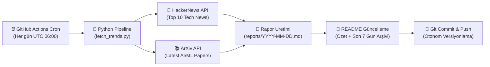

# 📡 AI & Tech Daily Radar

<p align="center">
  
  
  
  
  
</p>

> **AI & Tech Daily Radar**, her gün GitHub Actions üzerinde otonom olarak çalışan; HackerNews üzerindeki en sıcak teknoloji gelişmelerini ve ArXiv üzerindeki en yeni Yapay Zeka / Makine Öğrenimi (AI & ML) araştırma makalelerini toplayıp derleyen modern bir veri hattıdır (data pipeline).

---

<!-- LATEST_REPORT_START -->
### ⚡ Son Güncelleme: `2026-10-05`

> 📊 **Bugünün Özeti:** 10 HackerNews teknoloji trendi ve 5 ArXiv AI/ML akademik makalesi tarandı.  
> 📑 **Tam Rapor:** [Günün Raporunu Görüntüle (`reports/2026-10-05.md`)](reports/2026-10-05.md)

#### 🔥 HackerNews Öne Çıkanlar
| Başlık | Puan | Yorum | HN Linki |
|--------|:----:|:-----:|:--------:|
| [Tell HN: Bob Cringely has died](https://news.ycombinator.com/item?id=49949438) | ⭐ 902 | 💬 196 | [Tartışma](https://news.ycombinator.com/item?id=49949438) |
| [Run Qwen 3.8 Flash Next (125B) on consumer hardware (RTX 4090) at 100T/s](https://github.com/Niko1221/Strata) | ⭐ 845 | 💬 377 | [Tartışma](https://news.ycombinator.com/item?id=49953495) |
| [Turn off Apple Intelligence on macOS 27 and get its disk space back](https://github.com/omlahore/RemoveMacAI) | ⭐ 654 | 💬 444 | [Tartışma](https://news.ycombinator.com/item?id=49957116) |
| [Improper redaction reveals Google Data Center water and electricity usage](https://www.1011now.com/2026/09/30/more-questions-than-answers-about-lincolns-google-data-center-water-electricity-usage/) | ⭐ 448 | 💬 580 | [Tartışma](https://news.ycombinator.com/item?id=49957068) |
| [What is going on with ceiling fans](https://mcmansionhell.com/post/829127919552151552/what-is-going-on-with-ceiling-fans) | ⭐ 353 | 💬 306 | [Tartışma](https://news.ycombinator.com/item?id=49917536) |

#### 🤖 ArXiv AI/ML Öne Çıkan Araştırmalar
- 📄 **[Less Decoder is More Encoder: Geometric Representation Learning from Novel View Synthesis](http://arxiv.org/abs/2610.03717v1)**
  *This paper examines the role of Novel View Synthesis (NVS) in geometric representation learning. In principle, NVS should reason about 3D scene structure, thereby enabling transferable multi-view geom...*

- 📄 **[4DCodeBench: Benchmarking Agents on Inverse Graphics of Dynamic Scenes](http://arxiv.org/abs/2610.03715v1)**
  *We introduce 4DCodeBench, a benchmark for 4D inverse graphics through code generation, in which agents reconstruct dynamic scenes from video as executable graphics programs. To accomplish this, agents...*

- 📄 **[What Should World Models Forget? Stratified Retention for Continual Adaptation](http://arxiv.org/abs/2610.03713v1)**
  *Continual learning treats degradation on previously seen data as evidence of failure, a convention inherited from settings with a stationary prediction target, where a correct label remains correct in...*

#### 🗄️ Son 7 Günün Rapor Arşivi
- [📅 2026-10-05 Raporu](reports/2026-10-05.md)
- [📅 2026-10-04 Raporu](reports/2026-10-04.md)
- [📅 2026-10-03 Raporu](reports/2026-10-03.md)
<!-- LATEST_REPORT_END -->

---

## 🏗️ Mimari ve Nasıl Çalışır?

Bu sistem, harici bir sunucu veya veritabanı ihtiyacı olmadan tamamen **serverless** ve **Git-as-a-Database** yaklaşımıyla çalışacak şekilde tasarlanmıştır:



### ⚙️ Çalışma Aşamaları (ETL)

1. **Extract (Çıkarma):**
   - **HackerNews Algolia API:** Günün en popüler 10 teknoloji trendini (başlık, puan, yorum sayısı, URL) çeker.
   - **ArXiv API:** Bilgisayar Bilimleri / Yapay Zeka (`cs.AI`) ve Makine Öğrenimi (`cs.LG`) kategorilerinde yayımlanan en güncel 5 akademik makaleyi (`ElementTree` XML ayrıştırıcı ile) çeker.

2. **Transform (Dönüştürme):**
   - Alınan ham veriler standart bir Markdown formatına dönüştürülür.
   - Makale özetleri optimize edilir, tablolar ve bağlantılar biçimlendirilir.
   - Son 7 günün arşiv linkleri otomatik tespit edilir.

3. **Load (Yükleme & Dağıtım):**
   - Günün tarihine özel `reports/YYYY-MM-DD.md` dosyası oluşturulur.
   - Ana dizindeki `README.md` dosyasındaki belirlenmiş işaretçiler arasına güncel özet ve arşiv tablosu işlenir.
   - Değişiklikler GitHub Actions botu tarafından depoya geri `commit` ve `push` edilir.

---

## 🚀 Yerel Kurulum ve Çalıştırma

Projeyi yerel makinenizde test etmek isterseniz:

```bash
# 1. Projeyi klonlayın
git clone https://github.com/themuhammedguler/ai-tech-radar.git
cd ai-tech-radar

# 2. Bağımlılıkları yükleyin
pip install -r requirements.txt

# 3. Veri hattını çalıştırın
python src/fetch_trends.py
```

Rapor oluşturulduktan sonra `reports/` dizinini ve `README.md` dosyasını inceleyebilirsiniz.

---

## 📜 Lisans

Bu proje [MIT](LICENSE) lisansı ile lisanslanmıştır.
