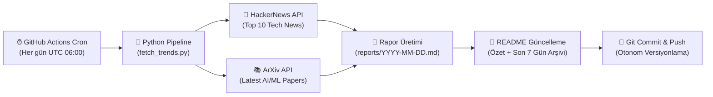

# 📡 AI & Tech Daily Radar

<p align="center">
  
  
  
  
  
</p>

> **AI & Tech Daily Radar**, her gün GitHub Actions üzerinde otonom olarak çalışan; HackerNews üzerindeki en sıcak teknoloji gelişmelerini ve ArXiv üzerindeki en yeni Yapay Zeka / Makine Öğrenimi (AI & ML) araştırma makalelerini toplayıp derleyen modern bir veri hattıdır (data pipeline).

---

<!-- LATEST_REPORT_START -->
### ⚡ Son Güncelleme: `2026-10-08`

> 📊 **Bugünün Özeti:** 10 HackerNews teknoloji trendi ve 5 ArXiv AI/ML akademik makalesi tarandı.  
> 📑 **Tam Rapor:** [Günün Raporunu Görüntüle (`reports/2026-10-08.md`)](reports/2026-10-08.md)

#### 🔥 HackerNews Öne Çıkanlar
| Başlık | Puan | Yorum | HN Linki |
|--------|:----:|:-----:|:--------:|
| [Margaret Hamilton has died](https://news.mit.edu/2026/margaret-hamilton-computing-pioneer-dies-1007) | ⭐ 1737 | 💬 182 | [Tartışma](https://news.ycombinator.com/item?id=49998895) |
| [Sharing AI progress in mathematics](https://openai.com/index/sharing-ai-progress-in-mathematics/) | ⭐ 1288 | 💬 1461 | [Tartışma](https://news.ycombinator.com/item?id=49984923) |
| [Claude Haiku 5.5](https://www.anthropic.com/claude-haiku-5-5) | ⭐ 935 | 💬 441 | [Tartışma](https://news.ycombinator.com/item?id=49996437) |
| [GPT‑6 and Intelligent UI for everyone](https://openai.com/index/gpt-6-for-everyone/) | ⭐ 675 | 💬 397 | [Tartışma](https://news.ycombinator.com/item?id=49996425) |
| [Show HN: Bigwords.page – Turn any screen into a sign. The URL is the app](https://bigwords.page/) | ⭐ 553 | 💬 143 | [Tartışma](https://news.ycombinator.com/item?id=49994443) |

#### 🤖 ArXiv AI/ML Öne Çıkan Araştırmalar
- 📄 **[Never Look Back: Understanding Persistence in 3D Object Memory from Egocentric Videos](http://arxiv.org/abs/2610.10538v1)**
  *As we move through the world and carry out everyday tasks, we encounter objects that may become relevant only later. We are capable of recalling where we left something or what was inside a container,...*

- 📄 **[Decoupling Exploration from Optimization in RLVR](http://arxiv.org/abs/2610.10536v1)**
  *Modern language models undergo reinforcement learning with verifiable rewards (RLVR) on top of already-trained checkpoints. A key promise of RLVR is the discovery of new reasoning strategies. In princ...*

- 📄 **[Long-WAM: Scaling the Context of World-Action Models](http://arxiv.org/abs/2610.10528v1)**
  *Real-time robot control demands enough visual history to infer motion and task progress, but processing that history can delay action. We present Long-WAM, a model-system framework for scaling the con...*

#### 🗄️ Son 7 Günün Rapor Arşivi
- [📅 2026-10-08 Raporu](reports/2026-10-08.md)
- [📅 2026-10-07 Raporu](reports/2026-10-07.md)
- [📅 2026-10-06 Raporu](reports/2026-10-06.md)
- [📅 2026-10-05 Raporu](reports/2026-10-05.md)
- [📅 2026-10-04 Raporu](reports/2026-10-04.md)
- [📅 2026-10-03 Raporu](reports/2026-10-03.md)
<!-- LATEST_REPORT_END -->

---

## 🏗️ Mimari ve Nasıl Çalışır?

Bu sistem, harici bir sunucu veya veritabanı ihtiyacı olmadan tamamen **serverless** ve **Git-as-a-Database** yaklaşımıyla çalışacak şekilde tasarlanmıştır:



### ⚙️ Çalışma Aşamaları (ETL)

1. **Extract (Çıkarma):**
   - **HackerNews Algolia API:** Günün en popüler 10 teknoloji trendini (başlık, puan, yorum sayısı, URL) çeker.
   - **ArXiv API:** Bilgisayar Bilimleri / Yapay Zeka (`cs.AI`) ve Makine Öğrenimi (`cs.LG`) kategorilerinde yayımlanan en güncel 5 akademik makaleyi (`ElementTree` XML ayrıştırıcı ile) çeker.

2. **Transform (Dönüştürme):**
   - Alınan ham veriler standart bir Markdown formatına dönüştürülür.
   - Makale özetleri optimize edilir, tablolar ve bağlantılar biçimlendirilir.
   - Son 7 günün arşiv linkleri otomatik tespit edilir.

3. **Load (Yükleme & Dağıtım):**
   - Günün tarihine özel `reports/YYYY-MM-DD.md` dosyası oluşturulur.
   - Ana dizindeki `README.md` dosyasındaki belirlenmiş işaretçiler arasına güncel özet ve arşiv tablosu işlenir.
   - Değişiklikler GitHub Actions botu tarafından depoya geri `commit` ve `push` edilir.

---

## 🚀 Yerel Kurulum ve Çalıştırma

Projeyi yerel makinenizde test etmek isterseniz:

```bash
# 1. Projeyi klonlayın
git clone https://github.com/themuhammedguler/ai-tech-radar.git
cd ai-tech-radar

# 2. Bağımlılıkları yükleyin
pip install -r requirements.txt

# 3. Veri hattını çalıştırın
python src/fetch_trends.py
```

Rapor oluşturulduktan sonra `reports/` dizinini ve `README.md` dosyasını inceleyebilirsiniz.

---

## 📜 Lisans

Bu proje [MIT](LICENSE) lisansı ile lisanslanmıştır.
